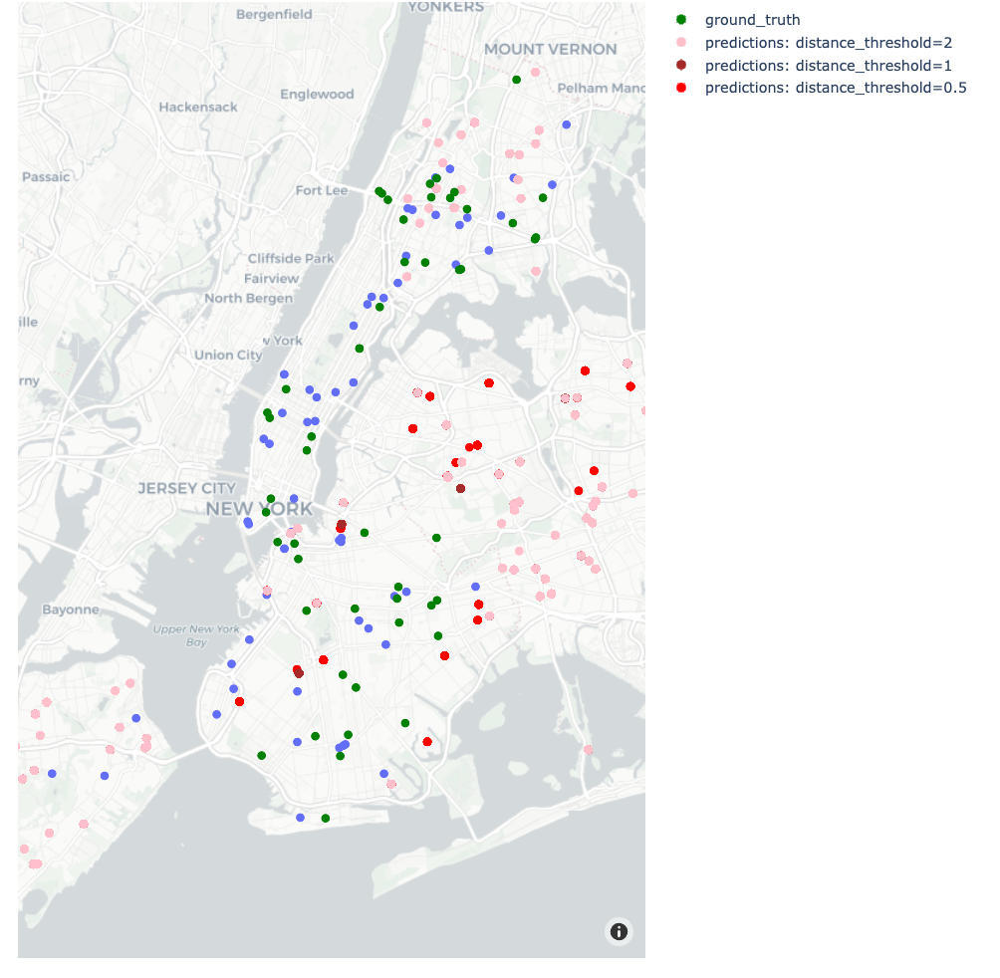
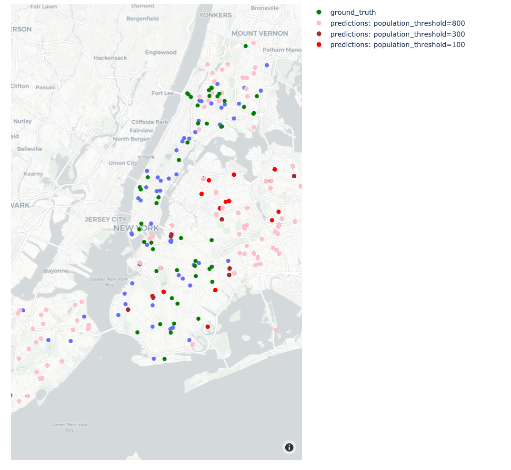
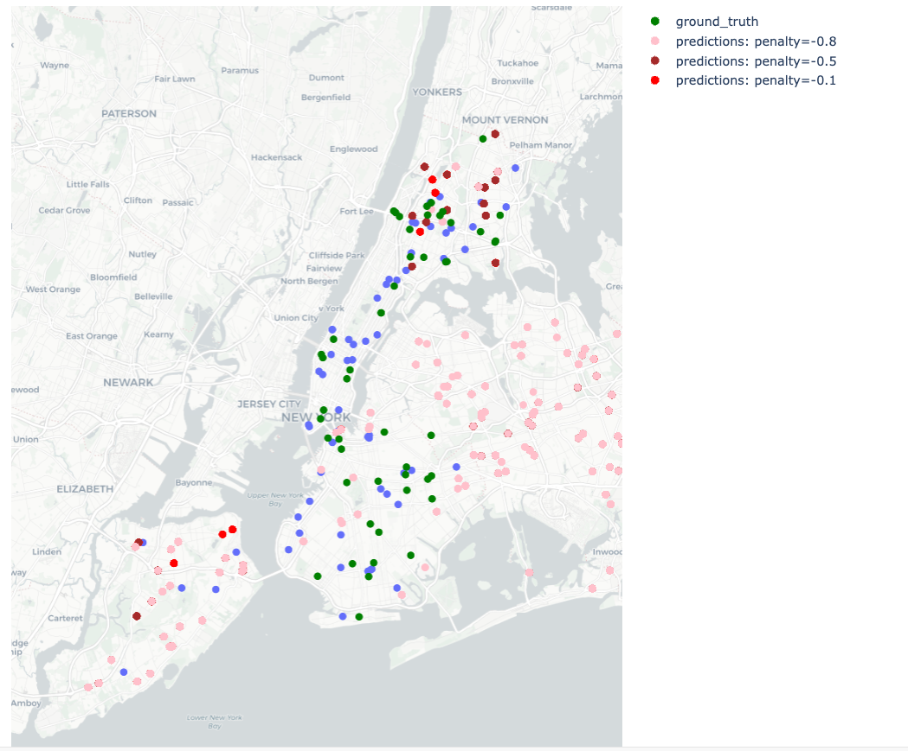

# UrbanHealthOpt

[](docs/UrbanHealthOpt_report.pdf) [](docs/UrbanHealthOpt_presentation.pdf) [](docs/UrbanHealthOpt.mp4)


## Introduction
Ensuring fair access to high-quality healthcare is crucial as cities continue to grow. The goal of this project is to optimize urban health center development using a rigorous, data-driven methodology. With a particular focus on New York City, we want to offer actionable insights for the thoughtful placement of healthcare facilities in urban settings by examining a wide range of characteristics, such as population density, economic conditions, and healthcare results.


## Project Overview
This project's journey starts with the gathering and examination of extensive datasets. To comprehend the current condition of the healthcare infrastructure, we make use of the extensive data from sources like the TIGER/Line Shapefiles, the American Community Survey, and the Health Facility General Information dataset.

## Solution Implementation

The development of our predictive model incorporated a comprehensive and technical approach, focusing on optimizing the placement of healthcare facilities in urban areas. Here's an overview of the process and the key technical aspects:

### **Data Preprocessing and Integration**: 
   - The project began with meticulous data preparation, involving cleaning, normalization, and transformation of various datasets like the American Community Survey and TIGER/Line Shapefiles.
   - We ensured the data was consistent, accurate, and suitable for analysis, setting a strong foundation for the model.

### **Feature Engineering and Selection**: 
   - Critical to our model, this step involved identifying and creating relevant features that could significantly impact healthcare facility placement.
   - Factors such as population density, demographics, economic status, and geographical coordinates were carefully integrated into our model.

### **Model Development and Implementation**: 
   - We employed advanced statistical and machine learning techniques to develop a model that could predict optimal locations for healthcare facilities.
   - The model was iteratively refined, incorporating feedback and insights gained from initial results.

### **Loss Function Formulation**: 
   - The model's effectiveness was measured using specially designed loss functions, each catering to different aspects of healthcare facility placement.
   - The **Decay Loss Function** ($\mathcal{L}_{\text{decay}}$) focused on recent hospital developments, giving more weight to newer healthcare facilities:
  
```math  
 \mathcal{L}_{\text{decay}}(y_{\text{true}}, y_{\text{pred}}, \Delta t) = \frac{1}{N} \sum_{i=1}^{N} \min_{\substack{j=1 \\ t_j \in [t_i - \Delta t, t_i + \Delta t]}}^{M} d(\text{block}_i, \text{hospital}_j)
```

   
   - The **Loss Function with No Time Constraint** ($\mathcal{L}_{\text{no time}}$) considered all hospitals when computing the distance, irrespective of their operational time frame:

```math
     \mathcal{L}_{\text{no time}}(y_{\text{true}}, y_{\text{pred}}) = \frac{1}{N} \sum_{i=1}^{N} \min_{j=1}^{M} d(\text{block}_i, \text{hospital}_j)
```

   - The **Corresponding Loss Function** ($\mathcal{L}_{\text{corresponding}}$) evaluated the distance between each block and a specific corresponding hospital:

```math
     \mathcal{L}_{\text{corresponding}}(y_{\text{true}}, y_{\text{pred}}, \Delta t) = \frac{1}{N} \sum_{i=1}^{N} d(\text{block}_i, \text{hospital}_{\pi(i)})
```

### **Model Evaluation and Refinement**: 

#### Comparing Simulation Results
Our approach acknowledges that there is no single set of ideal parameters for urban hospital planning. However, we can analyze how different parameter choices affect the outcomes of our model. Each simulation result offers insights into the impact of various parameters on the hospital distribution in urban areas.

#### Note on Simulation Figures
- **Blue dots** represent hospitals existing before the simulation.
- **Green dots** indicate the ground truth, i.e., hospitals actually built during the simulation period.
- **Other colors** depict the results with variations in specific parameters.

#### Varying the Distance Threshold Parameter
- The `distance_threshold` parameter determines the influence radius for building a hospital.
- A larger `distance_threshold` value typically leads to a broader spread of hospitals.

    *Figure: Increasing distance thresholds creates a larger spread of hospitals.*

#### Varying the Population Threshold Parameter
- The `population_threshold` parameter influences how population density affects hospital placement.
- Increasing this parameter tends to widen the area of influence for each hospital, leading to a more dispersed distribution.

    *Figure: Increasing population thresholds leads to a wider spread of hospitals.*

#### Varying the Penalty Parameter
- The `penalty` parameter quantifies the disincentive for placing hospitals near existing ones.
- Higher penalty values discourage clustering of hospitals, promoting a more uniform distribution.

    *Figure: Variation in penalty parameter and its impact on hospital distribution.*

Through these simulations, we continuously refine our model, striving to optimize the balance between various urban planning factors and healthcare accessibility needs. Our goal is to enhance the model's accuracy and applicability in real-world scenarios, ensuring it remains a valuable tool for urban healthcare planning.

This comprehensive approach ensured that our model was robust, scalable, and capable of delivering actionable insights for urban healthcare planning.

## Proposed Solution Overview

Our solution for optimizing urban health center planning is built upon a sophisticated statistical model, represented by the following key formula:

```math
\mathcal{M}(\text{{block\_id}}) = l_1 \cdot \frac{1}{\min(x^2, r^2)} \notag \\
\quad + l_2 \cdot g(\overline{\text{{age}}}) \notag \\
\quad + l_3 \cdot g(\overline{\text{{income}}}) \notag \\
\quad + l_4 \cdot g(\overline{\text{{hosp\_rate}}}) \notag \\
\quad + l_5 \cdot g(\overline{\text{{cardio\_cases}}}) \notag \\
\quad - \lambda \left( \# \text{{hospitals inside}} \min(x^2, r^2) \right)
```

In this model:
- $\mathcal{M}(block_id)$ calculates a score for potential hospital sites, integrating various demographic and healthcare factors.
- `l1`, `l2`, `l3`, `l4`, and `l5` are adjustable coefficients, allowing customization based on specific urban needs.
- `g` represents a quadratic function applied to average age, income, hospitalization rate, and cardiovascular cases, offering a detailed perspective of each area's healthcare demands.
- A penalization term discourages the clustering of hospitals, ensuring an even distribution across the urban landscape.
- **Dataset Collection**: Aggregating relevant data to establish a foundation for our analysis.
- **Exploratory Analysis**: Investigating patterns and relationships within the data to guide our model development.
- **Solution Implementation**: Crafting a model to predict optimal locations for new healthcare facilities based on demographic and geographic factors.
- **Comparative Analysis**: Assessing the performance of our model against real-world data to ensure its effectiveness.


### Future Work
The project's next phase involves expanding our model to include additional determinants such as food accessibility, air quality, and weather. In order to improve our recommendations, we also intend to take into account the precise sizes and types of hospitals that would be most beneficial to various communities. Using more sophisticated data processing methods to enhance our solution's performance is still a top objective.

## Conclusion
This project is a major step toward developing an all-inclusive urban healthcare planning system. Our dedication to the objective of providing all urban people with high-quality, easily accessible healthcare is demonstrated by our efforts to integrate a number of aspects and enhance the performance of our solution.


## Contents
### `data/`
The data folder includes all processed datasets needed to run the simulation. The simulation itself can directly be run with this file: `data/simulation_blocks.pkl`.

### `notebooks/`
All analysis and modelling notebooks are located here.

### `scripts/`
All processing and simulation scripts are located here.

## Usage

### Running the simulation
The simulation can be exceuted with the following steps.

#### Load and process datasets
```python
# read demographic and health datasets
covid = pd.read_excel("../../data/COVID_hosprate_by_year_inner.xlsx")
cardio = pd.read_excel("../../data/HeartAttacks_hosprate_by_year_inner.xlsx")
demo = pd.read_excel("../../data/final_merged_9_dec.xlsx")

# read hospital dataset
df = pd.read_csv("../../data/Health_Facility_General_Information_20231025.csv")

# create a single health dataset
health_data = pd.concat([cardio, covid.iloc[:, 8:]], axis="columns")

# merge health and demographic datasets
blocks = pd.merge(demo, health_data, on="GEOID20", how="inner")

# process datasets
blocks_updated = process_blocks_data(blocks)
df = process_hospital_data(df)
```

#### Setup a param grid
```python
# set simulation parameters
START_YEAR = pd.to_datetime("2019-01-01")
CURRENT_YEAR = pd.to_datetime("2020-01-01")
END_YEAR = pd.to_datetime("2022-01-01")

DATA_SET_START = df["Facility Open Date"].min()
DATA_SET_END = START_YEAR

TOTAL_HOSPITALS = len(df)
PROXIMITY_TIME_DELTA = pd.Timedelta(days=365 * 2 / 12)
inter_build_time = pd.Timedelta(
    days=(DATA_SET_END - DATA_SET_START).days / TOTAL_HOSPITALS
)

distance_thresholds = [1, 2, 5]
population_thresholds = [300, 800, 1500]
pop_coeff = [0.1, 0.33, 0.5]
age_coeff = [0.4, 0.34, 0.25]
income_coeff = [0.2, 0.33, 0.25]
covid_hosprate_coeff = [0.1, 0.33, 0.25]
cardio_coeff = [0.3, 0.33, 0.25]
penalties = [-0.8, -0.9, -1.0]

loss_functions = [
    loss_function_decay,
    loss_function_no_time_constraint,
    loss_function_corresponding,
]
```

#### Execute the simulation
```python
# run simulation
results = run_simulation_grid(
    blocks_updated,
    distance_thresholds,
    population_thresholds,
    pop_coeff,
    age_coeff,
    income_coeff,
    cardio_coeff,
    covid_hosprate_coeff,
    penalties,
    loss_functions,
    age_function,
    income_function,
    cardio_function,
    covid_hosprate_function,
    START_YEAR,
    CURRENT_YEAR,
    END_YEAR,
    inter_build_time,
    PROXIMITY_TIME_DELTA,
)
```